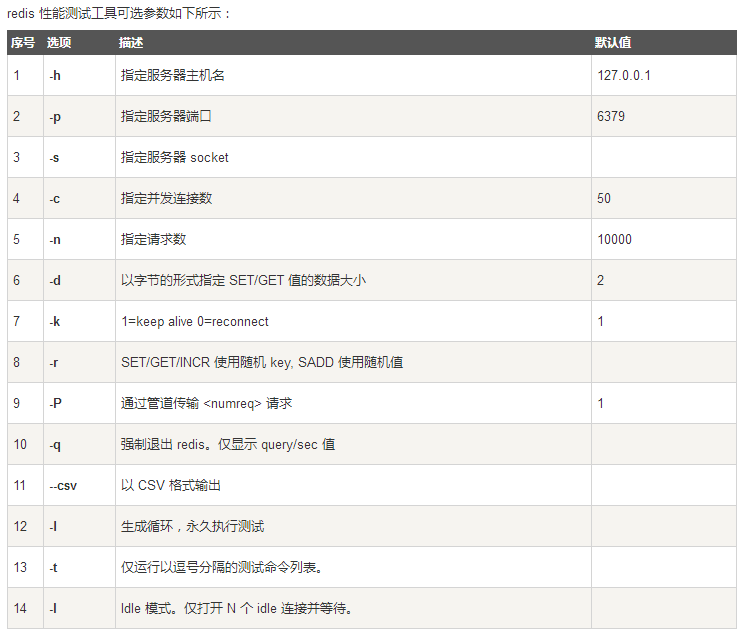
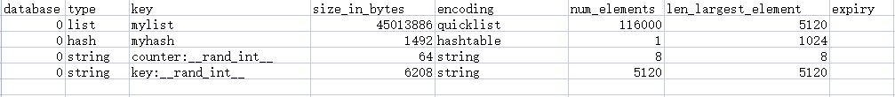

# 第八周：分布式缓存 & 分布式事务


### 1. 使用 redis benchmark 工具, 测试 10 20 50 100 200 1k 5k 字节 value 大小，redis get set 性能。

```base
$  redis-benchmark -h 127.0.0.1 -p 6379 -c 10 -n 1000 -d 10 -t get,set -q
SET: 45454.55 requests per second, p50=0.143 msec
GET: 52631.58 requests per second, p50=0.143 msec

$  redis-benchmark -h 127.0.0.1 -p 6379 -c 10 -n 1000 -d 20 -t get,set -q
SET: 45454.55 requests per second, p50=0.151 msec
GET: 34482.76 requests per second, p50=0.135 msec

$  redis-benchmark -h 127.0.0.1 -p 6379 -c 10 -n 1000 -d 50 -t get,set -q
SET: 43478.26 requests per second, p50=0.143 msec
GET: 52631.58 requests per second, p50=0.167 msec

$  redis-benchmark -h 127.0.0.1 -p 6379 -c 10 -n 1000 -d 100 -t get,set -q
SET: 47619.05 requests per second, p50=0.159 msec
GET: 47619.05 requests per second, p50=0.167 msec

$  redis-benchmark -h 127.0.0.1 -p 6379 -c 10 -n 1000 -d 200 -t get,set -q
SET: 50000.00 requests per second, p50=0.151 msec
GET: 52631.58 requests per second, p50=0.159 msec

$  redis-benchmark -h 127.0.0.1 -p 6379 -c 10 -n 1000 -d 1024 -t get,set -q
SET: 45454.55 requests per second, p50=0.159 msec
GET: 50000.00 requests per second, p50=0.159 msec

$  redis-benchmark -h 127.0.0.1 -p 6379 -c 10 -n 1000 -d 5120 -t get,set -q
SET: 43478.26 requests per second, p50=0.159 msec
GET: 41666.67 requests per second, p50=0.191 msec
```


### 2. 写入一定量的 kv 数据, 根据数据大小 1w-50w 自己评估, 结合写入前后的 info memory 信息  , 分析上述不同 value 大小下，平均每个 key 的占用内存空间。
> redis-rdb-tools

